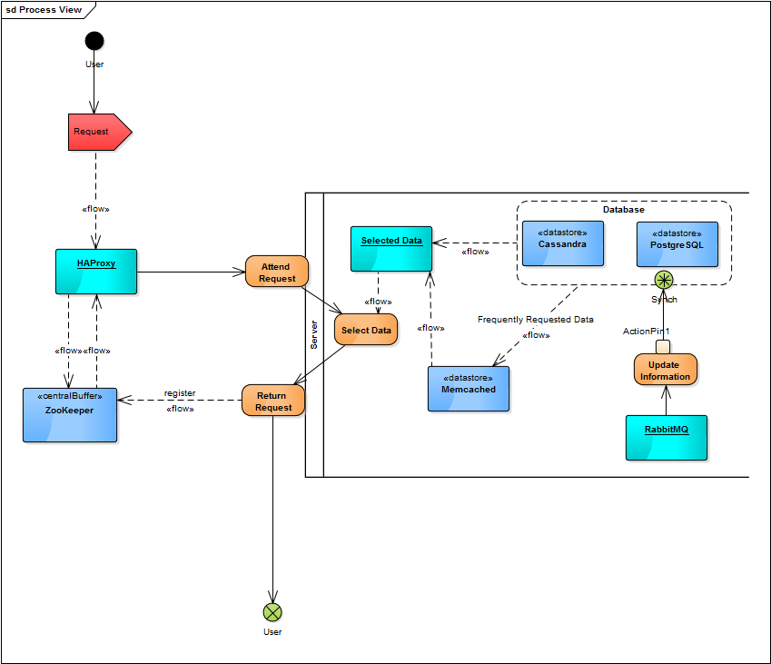

#Software Architecture

##Index

1. [Introduction](#introduction)
	* Reddit (The Software)
	* PostgreSQL
		* ThingDB
		* Relational data
	* Cassandra
		* Memcached
	* Asynchronous messages via RabbitMQ
	* ZooKeeper
2. [4+1 View Model](#4+1-view-model)
	* [Logical View](#logical-view)
		* UML Package Diagram
	* [Implementation View](#implementation-view)
		* UML Component Diagram
	* [Deployment View](#deployment-view)
		* UML Deployment Diagram
	* [Process View](#process-view)
		* UML Activity Diagram
	* [Use Case View](#use-case-view)
		* User Case Diagrams
			* Subreddits
			* Threads
			* Flairs
			* Communication
			* User Preferences
3. [References](#references)

#Introduction
In describing the architecture of reddit, it is useful to make a distinction between "reddit" the software and "reddit.com" the main user and developer of that software. reddit is able to run on a single machine, or through a data center with hundreds of machines. reddit.com is at the latter end of the spectrum and employs a few tricks that are outside of the reddit software itself as well. This architectural overview starts by describing what is intrinsic to reddit, and then goes on to explain what is currently set up for reddit.com.

## Reddit (The Software)

Unlike many other high-traffic sites, reddit is a very monolithic piece of software, for better or worse. The reddit application takes HTTP requests and does all the necessary work itself to fetch data from databases and build a proper response.

There are two core permanent data stores that reddit uses, PostgreSQL and Cassandra. Increasingly, ZooKeeper is becoming important for some forms of data storage, but its use remains optional at the code level right now. Memcached is used heavily to speed up many forms of lookup.

A fair (and increasing) amount of reddit's write workload is done outside of user requests to reduce the effect of processing slowdowns. Changes to be executed are queued up by a RabbitMQ messaging server and distributed out to backend jobs for processing.

## PostgreSQL

reddit uses [PostgreSQL](http://en.wikipedia.org/wiki/Postgres) in two distinct ways: through the *ThingDB* model, which is akin to a key/value store, and through more traditional relational models.

### ThingDB

The ThingDB model is the core Postgres data persistence mechanism for most of the objects that people would associate with reddit e.g. Links, Comments, Accounts, and Subreddits. In short, this data model is a mostly-schemaless key/value store that uses two tables for each thing type, its "thing" table and its "data" table.

The first table is the "thing" table. It has a fixed set of columns common to all things such as ID, whether or not the thing is deleted or marked spam, and the thing's upvote / downvote counts. Some of these columns are repurposed when they don't have a useful meaning for the thing type in question (e.g. a Subreddit's "ups" is its number of subscribers). Having these frequently used attributes in a fixed schema makes it easy to do relatively fast sorts on the things.

ThingDB's flexibility comes in through the "data" table. For every attribute on a thing that isn't represented by a column in the thing table, a row is created in the data table. This allows zero-effort flexibility in the schema of things, but does mean higher overhead via joins and the like to fetch the data.

Lookups done through the ThingDB model can fetch individual items or groups of items in batch. Writes are always done one item at a time.

### Relational data

There is some data that's stored in a more traditional relational form, including traffic statistics and transaction information for selling ads and gold subscriptions. This isn't terribly unique to reddit and not worth much more description.

## Cassandra

[Apache Cassandra](http://en.wikipedia.org/wiki/Apache_cassandra) is a distributed key/value datastore. It offers transparent [sharding](http://en.wikipedia.org/wiki/Shard_(database_architecture)) and is resistant to hardware failures.

### Memcached

[Memcached](http://en.wikipedia.org/wiki/Memcached) is used very heavily throughout reddit to add fast-access caching. This is the first of many layers of cache that reddit uses. Commonly used bits of pretty much anything are stored in memory so they can be quickly accessed as needed.

There are several distinct ways

* sgm

* [pagecache](https://github.com/PHOENIX-MEDIA/Magento-PageCache-powered-by-Varnish) - An internal cache of certain logged-out reddit responses, to reduce database load and improve responsiveness.

* [rendercache](https://https://www.drupal.org/project/render_cache) - This module attempts to alleviate needless rebuilding and re-rendering of entities on subsequent page loads by caching.
When an entity is updated a new cache key is generated; there's no waiting for a cache to time out.

* [memoize](https://clojuredocs.org/clojure.core/memoize) - Returns a memoized version of a referentially transparent function. The
memoized version of the function keeps a cache of the mapping from arguments
to results and, when calls with the same arguments are repeated often, has
higher performance at the expense of higher memory use.

## Asynchronous messages via RabbitMQ

Many tasks take a large amount of time to execute and would be ill suited to happen in-request while the user is waiting. Certain tasks that get performed regularly, such as needing to update the number of votes or add something to the search index, shouldn't hold up the main reddit app. Instead the main app writes these things to a queue, rabbit-mq managers these queues and executes the tasks when there are resources to do so.

## ZooKeeper

Unlike a simple website that just runs on a single web server, a site like Reddit uses a cluster of servers. Doing this allows the load to be spread about, and also to better cope with failures of single servers.
One product for controlling this sort of arrangement is called Apache Zookeeper.

Apache ZooKeeper is an effort to develop and maintain an open-source server which enables highly reliable distributed coordination. ZooKeeper is a centralized service for maintaining configuration information, naming, providing distributed synchronization, and providing group services. All of these kinds of services are used in some form or another by distributed applications.

#4+1 View Model
The 4+1 architectural view model was designed to "describe the architecture of software-intensive systems, based on the use of multiple, concurrent views". These views, that are described below, describe the system, each in its own perspective. Logical, development, process and physical views are the 4 main ones, as the use case make the +1.
Aside from that, the 4+1 view model deals with the design and implementation of the software, due to the assembling of architectural elements.

##Logical View
This view shows the most important abstractions in system as objects, object classes or packages. Its main function is to show the functionality that the system provides to end-users.

####UML Package Diagram
The package diagram focuses on the dependencies between all of the packages of a model.
There are two types of packages: package import and package merge.
The package import is the relationship between an importing namespace, that adds the names of the members of the package to its own namespace, and a package. This is the package by default.
The package merge is the direct relationship between two packages, showing that its contents are to be combined, resulting in a source and a target. If an element exists within both the packages, then the source element's definition will be expanded to include the target's definition.

##Implemation View
This particular view focuses on how reddit is built, which technological elements are required to run the system and its configurability, testability, etc and the existing frameworks and libraries it uses.
The components and connectors that are referred to in the next scope reflect software entities and their relationships.

We have two types of components, the application components, that are responsible for implementing domain-level responsibilies and the the infrastructure components, the ones needed to run the system but are not directly related to the application functionality. The only thing that states if a certain component is an application or infrastructure component is the application being studied.

####UML Component Diagrams
A component diagram represents how differente components can be intertwined to form larger components and software systems. A component is the requirement to run an executable, a document, a database or a library.
All of these components' interfaces are connected by an assembly connector. This relationship creates a provider and a consumer.

There are two types of connectors:

The assembly connector connects two different components, and labeling one as the provider and the other as the consumer. This connector is defined from an interface/port to a provided one.

The delegation connector links the external part of a component to its internal realization of the behavior of the component.

Reddit, specifically, uses "Model-View-Controller", a software architectural pattern that implements user interfaces. It receives a software and divides it into three parts that are connected:

The controller: sends commands to the model that updates his state. It also sends commands to the associated view to change the presentation of the model.

The model: stores all of the data retrieved by the commands from the controller and displayed in the view.

The view: the output based on the model.

##Deployment View

Deployment view shows which hardware components exist, what software they run and how they are connected. 
The hardware components are represented as "nodes" and each node has "artifacts" representing the software.

####UML Deployment Diagrams

[Reddit](https://reddit.com) is a website that can be accessed by any web browser. Although there is no official applications, reddit provides an API, so there are a lot of options to access reddit through mobile phones.
For data store, reddit uses [PostgreSQL](http://www.postgresql.org/) and is slowly moving to [Apache Cassandra](http://cassandra.apache.org/). It uses [RabbitMQ](https://www.rabbitmq.com/) for offline processing, [HAProxy](http://www.haproxy.org/) for load balacing and [memcached](http://www.memcached.org/) for caching.

##Process View
This view is the one who manages all of the dynamic aspects of the system, explains its processes and how they comunicate. It also addresses distribution of tasks, performance and integrators.
###UML Activity Diagrams
These diagrams are representations of the workflow of all of the activities and actions. 

Below is a flow diagram that represents how most of the work in reddit is done.

##Use Case View
The use case view is a list of actions and its steps to achieve a goal. The actor (in this case the user) has follow the steps correctly to reach his main goal.
The analysis of the use case is important to analise all of the requirements that are requested.
This view provides the summary of what the system has to offer and the body of the project. It also puts everyone on sync on what needs to be done and how it has to be done.
###User Case Diagrams
####Subreddits

#####Create a subreddit
Access the sidebar and click the button "Create your own subreddit".

Fill all the text area available (name, title, description, sidebar, submission text)-

Change the language, type of subreddit, the content options and the wiki option.

Set the filter for the posts, links and comments.
#####Search for a term
Access the sidebar and enter the term you're searching in the text box.

Sort the results by time, relevance, newest, hottest or on top.

It is also possible to do an advance search, adding the author of the post or the subreddit.
#####Modding a subreddit
It is only possible to mod a subreddit if you're invited to one or if you own a subreddit.
As a mod, you can:

Change the subreddit settings.

Edit the stylesheet (html).

Edit approved submitters.

Access the traffic stats.

Access the reports.

Access the spam.

Change banned and muted users.

Edit flairs.
####Threads

#####Post a thread
Access the sidebar and press "Submit a new link".

Create a link thread or a text thread.

Change the title.

Change the url it redirects to.

Choose the subreddit where you want to post the thread.
#####Comment a thread
Access a thread.

Fill the text box below the post.

Press "save".
#####Upvote/downvote a thread
Choose a thread.

Click on the arrow pointing up to upvote or click on the arrow pointing down to downvote.
#####Reply to a comment on a thread
Access a thread.

Choose the comment you want to reply to.

Press the "reply".

Fill the text box that just appeared.

Press "save".
####Flairs

#####Set a user flair
Access the sidebar and press the "edit flair" next to your username.

Choose the flair.

Press the checkbox that says "Show my flair on this subreddit. It looks like:".
###Set a thread flair
Create a thread.

Submit the thread.

Below the title of your thread press "flair".

Change to one that is available.
####Communication

#####Send private messages
Access www.reddit.com/user/username in which username is the user you want to send a message to.
####User preferences

#####Change options
In the right side of the screen press "Preferences" next to your username.

Change the link, comment, messaging, display, content, privacy and beta options.
#####Manage applications
In the right side of the screen press "Preferences" next to your username.

Press "apps" in the tabs menu.

Manage your authorized applications (either revoke their access or don't).
#####Access RSS feeds
In the right side of the screen press "Preferences" next to your username.

Press "RSS feeds" in the tabs menu.

Access the private and moderator listings, private profile pages, user inbox and moderator inbox.
#####Add friends
In the right side of the screen press "Preferences" next to your username.

Press "friends" in the tabs menu.

Fill the text box with the username of whom you want to add as a friend.
#####Block users from messaging
Receive a message from the user you want to block.

In the right side of the screen, press the envelope next to your username.

Press "messages" in the tabs menu.

Search for a message from the user you want to block.

Press "block user" below the message.

Press "yes".
#####Unblock users from messaging
In the right side of the screen press "Preferences" next to your username.

Press "blocked" in the tabs menu.

Search for the user you want to remove from your blocked list, and press "remove" next to their username.

Press "yes."
#####Change e-mail
In the right side of the screen press "Preferences" next to your username.

Press "password/email" in the tabs menu.

Input your password.

Change your e-mail.

Press "save".
#####Change password
In the right side of the screen press "Preferences" next to your username.

Press "password/email" in the tabs menu.

Input your password.

Input your password twice.

Press "save".
#####Deleting the account
In the right side of the screen press "Preferences" next to your username.

Press "delete" in the tabs menu.

Input your account credentials.

Optionally, fill the text area explaining why you're deleting the account.

Press the checkbox saying "I understand that deleted accounts are not recoverable".

Press "delete account".

#References
*https://www.reddit.com/r/redditdev/comments/3mztkk/making_reddit_documentation/*

*https://www.reddit.com/r/redditdev/comments/tszxg/trying_to_figure_out_the_reddit_code_is_there/c4pgo4x*

*https://www.reddit.com/r/redditdev/comments/3qjdz2/reddit_41_architectural_view_model/*

*http://sparxsystems.com/resources/uml2_tutorial/*

*https://en.wikipedia.org/wiki/Reddit*

*http://alistair.cockburn.us/Use+cases%2c+ten+years+later*

*http://alistair.cockburn.us/Why+I+still+use+use+cases*

*http://www.cs.ubc.ca/~gregor/teaching/papers/4+1view-architecture.pdf*

*http://www.agilemodeling.com/artifacts/packageDiagram.htm*

*http://www.uml-diagrams.org/package-diagrams.html*

##Authors
* Duarte Pinto - up201304777@fe.up.pt
* João Baião - up201305195@fe.up.pt
* Miguel Botelho - up201304828@fe.up.pt