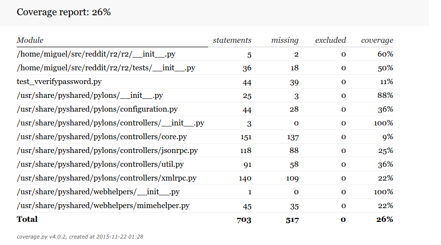

#Software Testing

##Index

1. [Introduction](#introduction)
	* Definitions, acronyms and abbreviations
	* How testable is reddit?
	* How to improve its testability?

2. [Testability of Software](#-testability-of-software)
	* [Controllability](#controllability)
		* UML Package Diagram
	* [Observability](#observability)
		* UML Component Diagram
	* [Separation Of Concerns](#separation-of-concerns)
		* UML Deployment Diagram
	* [Understandability](#understandability)
		* UML Activity Diagram
	* [Heterogeneity](#heterogeneity)

2. [Software Testing](#software-testing-1)
	* [Black Box Testing](#black-box-testing)
	* [White Box Testing](#white-box-testing)
	* [Unit Testing](#unit-testing)
		* Config
		* Lib
		* Models
	* [Functional Testing](#functional-testing)
	* [Integration Testing](#integration-testing)
		* Big Bang
		* Top-Down and Bottom-Up
			* Bottom-Up
			* Top-Down
			* Sandwich
			* Risky-Hardest
	* [Component Interface Testing](#component-interface-testing)
	* [System Testing](#system-testing)
	* [Acceptance Testing](#acceptance-testing)
	* [Compatibility Testing](#compatibility-testing)
	* [Regression Testing](#regression-testing)
	* [Software Performance Testing](#software-performance-testing)
		* Load Testing
		* Stress Testing
		* Soak Testing
		* Spike Testing
		* Configuration Testing
	* [Security Testing](#security-testing)

3. [Verification & Validation](#verifcation--validation)
	* Verification
	* Validation
4. [Coverage of Tests](#coverage-of-tests)

#Introduction
First of, reddit was created by a group of students to be used as an online bulletin board system. At first, the company was only a startup and reddit was supposed to be an app for ordering food. After the stakeholders (Y Combinator) received the idea, they gave their input on the subject, and reddit was created. It started with only 2 students, and no one expected it to be what it is today.

After analysing all of the tests that reddit has (on their public source code), we found out they are poor documented, are scrambled throughout folders and not entirely organized. There are tests that test the validity of a comment on a folder and then, on a different folder, we found tests that check the limit of a comment. Even the tests that are indeed documented (very few) are mostly unintelligible.

##Definitions, acronyms, and abbreviations
* CUT : *Component Under Test*. The component being tested.
* TDD : Test-driven development.
* Post : a thread.
* OP : *Original Poster*. The person who begins the selected post in that particular subreddit.

##How testable is reddit?
Theoretically, reddit can be very testable as it is possible to emulate a personal reddit in a Unix operating system through the install script that is given. 

In practice, because reddit is used on such a large scale, trying to run any type of testing, besides basic tests, on reddit is quite dificult as most of the bugs can't be simulated on such a small scale. They require a significant amount of data to be "farmed" first. 

##How to improve its testability?
**Test-driven development** is a software development process that relies on the repetition of a very short development cycle: first the developer writes an (initially failing) automated test case that defines a desired improvement or new function, then produces the minimum amount of code to pass that test, and finally refactors the new code to acceptable standards.

**Design for testability** is the design technique that focus in developing software that can be easily tested through automated tests. This helps ensure that software is easy to test and that new tests can easily be made in order to increase the tests coverage. 

Both of this techniques can be used to improve reddit testability. 

#Testability of Software

##Controllability
Most of reddit's components can be controlled fairly easily. That is what happens for most of the tests as a mock Component is created and it's state is changed on the run through direct accessors methods.

##Observability
Throughout our tests we found it dificult to run most of the tests, as it will be explained further in the section [Coverage of tests](#coverage-of-tests).
As so, we found that reddit's degree of observability is inconclusive.

##Isolateability
Altought it depends on the CUT we are analysing, as it can be seen in the tests, there is a limited number of tests that can be executed if you isolate the component. Because reddit is built to accommodate a large number of instances of each model (users, subreddits, posts, and others) most of the tests require it to be populated with a significant ammount of data. Despite this, most models allow for a mock component to be instantiated fairly easily which makes isolation of each CUT easier. This is the technique that is used throughout the diferent tests.

##Separation of concerns
####Unit tests

The structure of the tests mirrors the structure of the code (r2/tests/unit/config tests things in r2/config, etc.).
Because of that, they are separated into three diferent packages:

* config 
* lib
* models

######Config
The only tests being made here are to the [the feature-flagging system](https://github.com/reddit/reddit/tree/master/r2/r2/config/feature), which allows toggling sections of code according to a variety of attributes, such as admin features, beta testers features, gold accounts, and others. 

######Lib
Tests the functions related to back-end side of reddit, like testing the ulrparsing, css filtering, cookie management and others.

Appart from this this package contains three other packages inside:

* **authorize** - test the *API* authorizations. 
* **providers** - mainly tests image resizing.
* **validator** - tests validation of inputted information such as password validation, emails and subreddit's names. 

######Models
The model subset of tests are for testing the various models reddit uses - that is, the object representations of data from the database, and the methods contained within them (see [ORM](https://en.wikipedia.org/wiki/Object-relational_mapping) for a description of the more general system).

##Understandability
Although there isn't any proper documentation(you can find some comments occasionally) most things aren't very hard to understand if you are familiarized with how reddit.com works. 

##Heterogeneity
The source code of reddit is mostly written in Python. After searching for a while, we came to the conclusion that [coverage.py](http://coverage.readthedocs.org/en/latest/) was the best tool to use. After installing reddit on Ubuntu through the script a mock subreddit needs to be set up and populated with enough data. Only then can the provided tests be ran. 

#Software Testing
After analysing reddit's code we found out that only two types of testing are being done, the Unit Testing and Functional Testing. However, not all of reddit's code is public, as the security part of the code is private. With this in mind, it's possible that Security Testing exists but we just don't have access to it.

##Black Box Testing
Black Box testing consists on receiving a certain input and examine the output. It has no view to the internal structure of the software, hence the name "Black Box". It receives an input, the Black Box is the internal structure, and in the end has an output. The tester is only aware of what the software is supposed to do, but doesn't need to know how the software works.

##White Box Testing
Opposed to Black Box Testing, White Box Testing is a method that tests the internal structure of the software. To develop this type of testing, the tester is required to have an internal perspective of the system and then it chooses different inputs and determine the correct outputs.

This type of testing can be used in unit, integration and system levels of testing. Even though it can discover a lot of errors and flaws within the CUT, it can also miss unimplemented parts of the initial requirements.

##Unit Testing
Unit testing is one of the most common types of testing, as it tests the source code (the scope of the software). It tests an entire unit, that is usually conceived as the smallest testable part of the software. These tests are usually created by the developers and are short fragments. Besides that, the tests should also be independent between one another.

This type of testing tends to find "bugs" and problems early in the development stage but also has its flaws, as it doesn't catch system-level errors and doesn't take into account issues with performance.

#####Config
After analysing the Config folder that reddit has, we've found that these tests are not well documented and are not easy to understand. However, they test a lot of features, such as if the user has gold, if it's logged in, if it's an admin, an employee, if a certain subreddit already exists. All of these are created using Mock Objects and Classes (fake objects that simulate the behaviour of of a real object).

#####Lib
This folder is, by far, the one with most extensive tests. Most of it is uncompreensible, as shown by "Test Cookies Upgrade" (what's a cookie?). It also tests if the user has inputed the correct password,  if it has a valid user e-mail and, again, the name of a subreddit when creating it. Image resize, the XML they use to store the user data, the parse of URL's, the padding and encryption on strings, CSS on different browsers, are all tested here.

#####Models
Different from the Config folder, even though these tests are commented, they don't use the best language for the case, as some of the comments are only understandable by the ones who created it, i.e. "This class exists to allow us to call the _qa() method on Comments without having to dick around with everything else they support". These tests work mainly on the comments from threads, creating threads and the user permissions on subreddits.

##Functional Testing
Functional testing is a type of black box testing whose tests are based on the specifications of the software CUT. They accept different inputs and then the output is examined, leaving the structure of the program out of the equation. This type of test only shows what the software is doing.

Even though reddit contains a folder with the functional tests, there's only a file init.py, with 20 lines and it's mostly a license.

##Integration Testing
Integration testing is the moment when different software modules are combined and tested together. The function of these tests are to verify different requirements, such as performance, functionality and reliability. There are different types of integration testing:

#####Big Bang
In this approach, most of the modules are coupled together to form a complete software system or major part of the system and then used for integration testing. This method is very effective for saving time in the integration testing process. Its biggest flaw is depending on the results of the test cases.

#####Top-Down and Bottom-Up

######Bottom-Up
In this approach the lowest level components are the ones being tested first, all the way up to the highest level. The biggest problem with this method is the fact that it needs all of the modules of the same development level completed.

######Top-Down
Exactly like the method described above, but backwards. This way, it's easier to find a missing link in the software.

######Sandwich
This method combines Bottom-Up with Top-Down.

######Risky-Hardest
In this method, the integration testing starts with the modules that are riskiest and hardest.

##Component Interface Testing
The Component Interface testing is the Testing used to check the data that is passed between different units and subsystems. This data is usually considered as "message packets" and the tests focus on checking unusual data values, such as extreme ones.

##System Testing
The System Testing is only conducted on a complete system to check the system's compliance with the initial requirements. The software components tested are the ones who already passed the Integration Testing and the software system itself. System testing seeks to detect flaws within the assemblage between modules and within the system as a whole.

The test is performed on the whole system and has in mind the SRS document. It tests the design, the behaviour and the expectations of the stakeholder. It can also test beyond the bounds defined in the SRS.

##Acceptance Testing 

> Formal testing conducted to determine whether or not a
system satisfies its acceptance criteria and to enable a
customer, a user, or other authorized entity to determine
whether or not to accept the system

> - IEEE Standard Glossary of Software Engineering Terminology 610.12-1990 

Usually acceptance testing is of the responsibility of the customer.
As of November 21st 2015, Reddit.com is the 35th most visted website worldwide. Due to the large number of daily users(costumers) it is safe to assume that when it comes to acceptance testing reddit is well prepared.

##Compatibility Testing
This test is pretty self-explanatory. It tests the software's compatibility with different types of hardware and software. It tests the hardware plataform compatibility, the bandwidth handling capacity of the network hardware, the different peripherals, the operating system used and even the browser compatibility.

##Regression Testing
Regression testing is used after adding a feature, patch or enhancement on the original software. It ensures that these new changes don't introduce new faults or bugs in the software. It can also check if a change on a module affects a different one. It consists on rerunning previous tests and see if the program behaviour is no longer the same and if previous faults have re-emerged.

##Software Performance Testing
This specific type of testing tests the responsiveness and stability of the system under specific circumstances. It can also be used to measure different quality attributes in the system, such as reliability and resource usage.

######Load Testing
This is the simplest form of performance testing. It tries to understand the behaviour of a system when under a specific load. It checks for the response times of all the operations, trying to identify bottlenecks (the capacity of an application is severely limited by one component) in the software.

######Stress Testing
Stress Testing is trying to use the maximum capacity of the system. It tries to understand its limits and robustness in terms of managing an extreme load, giving the developers a sense of how well the software reacts under circumstances above the expected maximum.

######Soak Testing
As explained by the name, it checks the endurance of the system. It sees how well it reacts given the expected load during a long period of time. The memory utilization is monitored during this test to detect potential leaks. It also tries to detect if the system has some sort of degradation during this soak. The ultimate goal is to discover how the system behaves under a continued use.

######Spike Testing
Again, as the name states, it gives spikes of load during a period of time. Having above maximum load during a specific frame of time and then dropping to a minimum. It determines how the system reacts to these dramativ changes and if it fails or suffers from it.

######Configuration Testing
This test tries to understand how the system behaves when different configurations are changed.

##Security Testing
This type of test is executed to check if the product is secured. It verifies if the product is vulnerable to attacks, if there is an attempt of hack or an unauthorized login. It also determines, if the system is breached, if the product protects the data, mantains all of the functionalities and stops any type of information leak.

#Verification & Validation
These two procedures are used together to check if the product meets the requirements and specifications that were determined in the beginning of the development. The V&V is usually performed by a third party with no affiliation to both parties. The validation component assures that the product meets needs of the stakeholder.

> "Validation. The assurance that a product, service, or system meets the needs of the customer and other identified stakeholders. It often involves acceptance and suitability with external customers. Contrast with verification."

> "Verification. The evaluation of whether or not a product, service, or system complies with a regulation, requirement, specification, or imposed condition. It is often an internal process. Contrast with validation."
> - PMBOK guide, a standard adopted by IEEE

There are two queries that are highly associated with Validation and Verification. "Are you building the right thing?" is associated with Validation, refering to the user's needs, and "Are you building it right?" associates with Verification, checking that the specifications are correctly implemented.

##Verification
Verification is used to determine if a product meets the design specifications. During development, the verification involves performing special tests to simulate a piece of the system, or the entirety of the system. Afterwards, it performs a review of the results. This procedure repeats tests specifically made to ensure that the product is in order with the initial design requirements. It is often an internal process.

##Validation
Validation is the primary method to check if a product is a product that meets the operational needs of the people who use it. Validation procedures focus around modeling development and verification flow, and using the simulations to predict "bugs" and flaws in the system that may lead to incomplete verification of the product. A set of validation requirements and specifications are used to qualify the flows of the product. This process establishes evidence of high degree of assurance that the product is meeting the intended requirements. It is usually an external process.

#Coverage of tests

##All of the information below is outdated. I will get back on it, as i've found a way to run all of the tests at once and give a more realistic view of the code coverage. I'll get back on it tomorrow.

The tests were run one by one and most of them gave back errors, so the results were pretty inconclusive. We asked on [r/redditdev](https://www.reddit.com/r/redditdev) for a solution, and [u/13steinj](https://www.reddit.com/user/13steinj) gave us a kind of script to run all the tests at once. After struggling with the script and trying to change it, we kept getting errors. So, this is the only code coverage we were able to grab:

As we can see (even though it's inconclusive), reddit's coverage is pretty poor, standing on a 26% coverage. 
